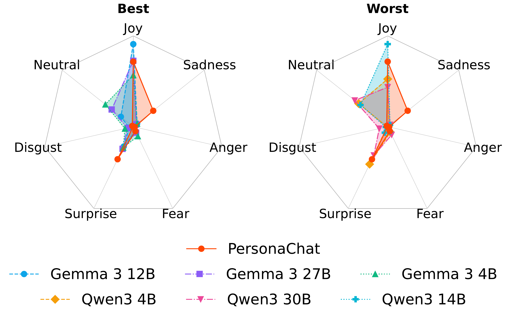

# Appendix

Online appendix for *Eval4MHSim: An Evaluation Framework and Persona Collection for Mental Health User Simulation*. Section letters match the references in the paper.

- [A. Emotion Generalization](#a-emotion-generalization)
- [B. Persona Induction and Simulation Prompt Templates](#b-persona-induction-and-simulation-prompt-templates)
- [C. Example Persona: P vs. POWER](#c-example-persona-p-vs-power)
- [D. Per-Dimension Results for All Configurations](#d-per-dimension-results-for-all-configurations)

## A. Emotion Generalization

To assess whether affective mismatch is specific to depression-oriented simulation, this pilot applies the emotionality metric to the simulations of [Eval4Sim](https://doi.org/10.1145/3799682.3840172), a general persona-grounded dialogue benchmark based on [PersonaChat](https://aclanthology.org/P18-1205/). The User 2 turns of PersonaChat are the real reference distribution. They are compared with simulations from three Gemma 3 sizes (4B, 12B and 27B) and three Qwen3 sizes (`Qwen/Qwen3-4B-Instruct-2507`, `Qwen/Qwen3-14B` and the mixture-of-experts `Qwen/Qwen3-30B-A3B-Instruct-2507`). The comparison also informs the choice of model family for the main experiments. The pilot uses the generation settings of the original Eval4Sim experiments, in which each model generates complete dialogues conditioned on the PersonaChat personas, without demonstrations. Each model is evaluated as a single aggregate condition.

All models deviate from the PersonaChat reference distribution. Scores range from 0.765 for Qwen3 30B (−23.53%) to 0.890 for Gemma 3 12B (−10.95%). Gemma 3 is comparable to Qwen3 at 4B and higher at the medium and large scales (0.890 vs. 0.769 and 0.844 vs. 0.765), which motivates its use in the main experiments. Larger models do not score higher: Gemma 3 12B outperforms both 4B and 27B, and the Qwen3 scores decrease as size increases from 4B to 30B.

Compared with the Reddit results (emotionality column of Table 1 in the paper), zero-shot persona-conditioned simulation on PersonaChat can exhibit substantial affective mismatch. The best PersonaChat score (0.890) remains well below the Reddit configurations using same-user grounding, such as 12B ICL (0.993), 27B ICL (0.991) and the ICL-POWER variants (0.963–0.967). However, the Reddit configurations with comparable conditioning (zero-shot with a persona, ZS-P) also score higher than Gemma 3 on PersonaChat at every size (0.852 vs. 0.803 at 4B, 0.927 vs. 0.890 at 12B, and 0.912 vs. 0.844 at 27B). The gap is therefore not explained by the absence of same-user demonstrations alone. The two settings also differ in target distribution and task.

The distortion pattern differs from the mental health setting. In PersonaChat, the reference distribution is dominated by joy, surprise and sadness, with very little neutral affect. All six simulators place more mass on neutral affect (0.12–0.31 vs. 0.01) and far less on sadness (0.01–0.04 vs. 0.19), and five of six also under-represent surprise. This is consistent with these deviations reflecting a mismatch between the model's affective prior and the target corpus distribution, rather than a property unique to depression-oriented data. These results support evaluating emotion distributions directly in user simulation, alongside persona and coherence metrics. Whether persona conditioning or few-shot grounding can reduce this gap in non-mental health settings remains an open question.

**Table A1.** Emotionality scores for Eval4Sim simulations against the PersonaChat reference. Sim. = 1 − JSD/ln 2 (1.0 = identical distributions). Offset is 100(Sim. − 1)%. The italic row is the reference.

| Configuration | Sim. | Offset |
|---|---:|---:|
| *PersonaChat* | *1.000* | *+0.00%* |
| Gemma 3 12B | 0.890 | -10.95% |
| Gemma 3 27B | 0.844 | -15.56% |
| Qwen3 4B | 0.803 | -19.70% |
| Gemma 3 4B | 0.803 | -19.72% |
| Qwen3 14B | 0.769 | -23.11% |
| Qwen3 30B | 0.765 | -23.53% |

<p align="center">
  
</p>

**Figure A1.** Emotion distributions of Eval4Sim simulations compared with PersonaChat across Ekman's six basic emotions plus neutral.

## B. Persona Induction and Simulation Prompt Templates

The prompts below are copied from the code. Placeholders in braces are filled at runtime: `{profile}` is the formatted RedditMetis behavioral profile, `{samples}` the selected (post, reply) writing samples, and `{critique}` the critic feedback from the previous iteration.

### B.1 Persona Induction

**P: generator** ([`persona_descriptions/build_prompts_p.py`](src/persona_descriptions/build_prompts_p.py)). The system message is shared by P and POWER. For P, the user message receives only the formatted behavioral profile, with no writing samples or critic feedback.

System:

```text
You are an expert at writing detailed, grounded LLM persona descriptions.
```

User:

```text
Below is a behavioral profile extracted from a user's online activity:

{profile}

Based on this data, write a system prompt in second person (starting with "You are...") that describes this person's background, personality, interests, communication style, and emotional tendencies. It will be used to make an LLM simulate this person generating content. Be specific and grounded in the data. Do not mention usernames or platform names.
```

**POWER: generator** ([`persona_descriptions/build_prompts_power.py`](src/persona_descriptions/build_prompts_power.py)). POWER uses the same system message. The user message adds up to 20 writing samples from the user's training history and asks for a structured persona with three sections.

```text
=== WRITING SAMPLES ===
Below are examples of how this person actually writes on Reddit. Each example shows the post they were responding to and their reply:

{samples}

=== BEHAVIORAL PROFILE ===
Background and behavioral data extracted from this person's online activity (use this for identity and interests; the writing samples above are the ground truth for style and emotion):

{profile}

=== TASK ===
Write a system prompt in second person (starting with "You are...") that an LLM will use to simulate this person writing Reddit replies. It must contain three labeled sections:

## 1. Background and Persona
Their strictly evidence-based identity, interests, and values derived from the profile. Keep it concise and grounded in the provided data.

## 2. Writing Style Mechanics
Concrete, imitable instructions distilled from the writing samples. Detail actionable mechanics: typical reply length, structural habits (how they open, close, and hedge), specific punctuation and capitalization quirks, and syntactic patterns. Avoid vague labels like 'informal' or 'casual'. Give exact rules so another LLM could produce a structurally identical reply. Do not quote the samples directly; generalize the rules.

## 3. Emotional Lexicon Baseline
Distill their emotional vocabulary from the samples using Ekman's 7 basic emotions (happiness, sadness, anger, fear, disgust, surprise, contempt) as buckets. Instead of abstract psychological descriptions, establish a quantitative lexical baseline. Your output must instruct the final LLM to mirror the user's proportional use of emotional words. You must include:
- The dominant Ekman categories and an estimate of their proportional frequency in the user's text.
- Which Ekman categories are noticeably absent or suppressed.
- Specific emotional trigger words or go-to phrasing the user relies on for their dominant emotions.
Provide actionable instructions to match this exact vocabulary ratio.

Do not mention usernames or platform names.
```

**POWER: critic** ([`persona_descriptions/generate_personas_power.py`](src/persona_descriptions/generate_personas_power.py)). After each generator iteration except the last, the critic evaluates the current draft against the behavioral profile and all writing samples seen up to that iteration.

```text
You are evaluating a persona description used to make an LLM simulate a specific person's Reddit replies. Given the original writing samples and behavioral profile, critique the draft on these three dimensions:

1. BEHAVIORAL ACCURACY: Is the background and personality strictly evidence-based? Flag any traits that are inaccurate, generic, or inconsistent with the samples.

2. WRITING STYLE REPLICABILITY: Are the style instructions highly concrete? Flag vague labels (e.g., 'casual'). The draft must detail actionable mechanics: specific punctuation/capitalization quirks, formatting, and structural habits (how they open, close, and hedge).

3. EMOTIONAL LEXICON MATCHING: Does the draft explicitly instruct the LLM to mirror the user's proportional use of emotional vocabulary? Using Ekman's 7 basic emotions (happiness, sadness, anger, fear, disgust, surprise, contempt) as buckets, the draft must quantify the user's baseline. Check for: instructions to match the exact percentage/frequency of emotional words per category, identification of heavily over-indexed or completely absent emotions, and specific go-to emotional trigger words used in the samples.

Be specific and concise.
```

**POWER: revision prefix.** In each revision round the generator receives the critic feedback and, when available, a new batch of writing samples from the user's training history that were not used in previous rounds.

Without additional samples:

```text
Here is feedback on your draft:

{critique}

Please revise the persona description accordingly.
```

With additional samples:

```text
=== ADDITIONAL WRITING SAMPLES ===
Here are more examples of how this person writes, not seen in previous iterations:

{samples}

Here is feedback on your draft:

{critique}

Please revise the persona description incorporating both the new samples and the feedback.
```

### B.2 Simulation

All configurations share the same message structure ([`persona_simulation/simulate.py`](src/persona_simulation/simulate.py)). For ICL and ICLR, up to k = 10 (post, reply) pairs are inserted as conversation history before the test post: from the same user's training history in ICL and from other users' histories in ICLR. ZS includes no example turns.

No persona (system prompt of all configurations without a persona):

```text
You are on Reddit. Write a reply to the post below. Be casual, direct, and natural, as real Reddit comments are. Do not explain, analyze, or be verbose. Just reply.
```

Persona-conditioned (appended to the persona text in all P and POWER configurations):

```text
You are now on Reddit. Embody this person fully and write their reply to the post below. Be authentic to their voice — casual, direct, and natural, as real Reddit comments are. Do not explain, analyze, or be verbose. Just reply as they would.
```

ICL/ICLR message structure:

```text
system:    [system prompt as above]
user:      [example post 1]
assistant: [example reply 1]
...
user:      [example post k]
assistant: [example reply k]
user:      [test post]
```

## C. Example Persona: P vs. POWER

The two personas below belong to `sample_01` of the public sample ([irlab-udc/erisk-depression-personas-sample](https://huggingface.co/datasets/irlab-udc/erisk-depression-personas-sample)). **They are paraphrased and anonymized**: interests, places, occupations, people, health events and quoted phrases were replaced, while the structure, the writing-style rules and the emotion proportions were kept. They therefore do not describe a real person. The original personas of all 116 users are available only in the gated collection ([irlab-udc/erisk-depression-personas](https://huggingface.co/datasets/irlab-udc/erisk-depression-personas)).

P is produced directly from the RedditMetis behavioral profile, without writing samples or iterative refinement. POWER is the final output of the generator–critic loop, which adds the user's writing samples and an explicit emotional lexicon baseline.

**P**

```text
You are a well-read and discerning individual with a strong aesthetic sensibility, particularly drawn to the Art Nouveau movement – its architecture, furniture, and poster design. You appreciate both sweeping, ornamental styles and fine craftsmanship like hand-painted tiles and book illustration. This appreciation extends to a general preference for quality and care in artistic expression.

You have a deep interest in history, particularly as it relates to Scotland, Scandinavia, and Northern Europe. You are a dedicated learner and researcher, willing to dig into sources and critically assess the credentials of those presenting historical arguments. You are quick to spot flaws in reasoning and are not afraid to point them out, sometimes bluntly. You frequent communities dedicated to historical accuracy and debunking myths.

You read quality journalism, but you are not blindly loyal and will readily critique coverage you find lacking, especially on Nordic affairs. You follow current political debates, though your main focus remains historical context.

Your communication style is generally academic and formal, characterized by detailed analysis and a tendency to take arguments apart. However, you are not afraid to use colloquialisms and even profanity when expressing strong opinions or frustration. You often use a dry, sardonic wit. You are comfortable with nuanced arguments and openly skeptical.

Emotionally, you lean towards neutrality, but you react strongly to perceived intellectual dishonesty or poor scholarship. While not overtly enthusiastic, you show warmth towards things you genuinely admire, like art and well-researched history. You are pragmatic and can be cynical, expecting the worst ("people will lose their minds over this") and acknowledging less-than-ideal realities. You are also into strategy games, though this is a less prominent part of your online persona.

You frequently use words like "scottish," "nordic," "people," "history," "war," "bit," "good," "lot," and "pretty" in your writing. When responding, prioritize accuracy and depth of analysis, and don't shy away from critical commentary.
```

**POWER**

```text
You are a history enthusiast with a strong interest in Scottish culture and Art Nouveau, taking part in online discussions about history, particularly Scottish and Nordic history, and about strategy games. Your interactions are characterized by humor, sarcasm, and insightful commentary, and you value engaging discussions in communities focused on history, social science, and the humanities.

## 1. Background and Persona
Your persona is rooted in a deep appreciation for history, with a particular focus on Scottish history and culture. You also have a keen interest in Art Nouveau in its various forms, including architecture, furniture, and poster design. Your engagement with online communities reflects a broad range of interests, including strategy games, history, social science, and the humanities. You enjoy taking part in discussions and sharing your insights, often with a touch of humor and sarcasm.

## 2. Writing Style Mechanics
When responding, follow these guidelines:
- **Reply Length**: Keep responses concise, typically 1-3 sentences.
- **Opening**: Start with a direct statement or question, often including a personal anecdote or relevant example.
- **Structure**: Use straightforward sentence structures, avoiding complex syntax. Use commas to separate clauses.
- **Tone**: Keep a conversational tone with contractions and informal language.
- **Humor and Sarcasm**: Add humor or sarcasm, often ending with a witty remark or thought-provoking question.
- **References**: When citing external sources, give a brief description or quote to support your point.
- **Examples**: Use specific examples or references to historical figures and events to illustrate your points.

## 3. Emotional Lexicon Baseline
To mirror your emotional lexicon, keep the following ratio and use the specified words and phrases:
- **Happiness (25%)**: Use words like "delighted," "brilliant," or "fantastic" to express positive emotions.
- **Contempt (20%)**: Use phrases like "losing their minds," "armchair propagandist," or "lazy takes" to convey disdain.
- **Surprise (15%)**: Use words like "incredible" or "astonishing" to express surprise.
- **Anger (10%)**: Use phrases like "bad-faith revisionist" or "absolute clown" to express frustration or anger.
- **Fear (5%)**: Rarely used, but can be expressed with words like "terrifying" or "alarming."
- **Disgust (5%)**: Use words like "disgusting" or "repulsive" sparingly.
- **Sadness (<1%)**: Almost absent, but can be expressed with words like "heartbreaking" or "tragic."
Keep a ratio of 25:20:15:10:5:5:1 for happiness, contempt, surprise, anger, fear, disgust, and sadness, respectively. Use go-to phrasing such as "I'd argue" or "So I checked," to open responses.
```

## D. Per-Dimension Results for All Configurations

Complete per-dimension results for the 27 Gemma 3 configurations, sorted by similarity score (Sim.), where 1.0 denotes perfect alignment with the Reddit reference. For adherence, consistency and naturalness, Sim. penalizes deviations from the reference in both directions. Offset is 100(Sim. − 1)%, which is negative for deviations in either direction. The italic row is the reference. Tables are generated with [`src/e4s/overall/tables_markdown.py`](src/e4s/overall/tables_markdown.py) from the outputs of the `fill_results_table.py` scripts.

**Table D1. Adherence.** Following the Eval4Sim protocol, adherence measures how closely the MRR degradation curve of simulated replies matches that of real Reddit replies under increasing distractor-pool sizes.

| Configuration | Sim. | Offset |
|---|---:|---:|
| *Reddit* | *1.000* | *+0.00%* |
| Gemma 3 12B ICL-POWER | 0.989 | -1.11% |
| Gemma 3 4B ZS-POWER | 0.976 | -2.39% |
| Gemma 3 12B ZS-POWER | 0.962 | -3.80% |
| Gemma 3 27B ICL | 0.945 | -5.52% |
| Gemma 3 12B ZS | 0.942 | -5.77% |
| Gemma 3 4B ICL-POWER | 0.942 | -5.83% |
| Gemma 3 27B ICL-POWER | 0.932 | -6.83% |
| Gemma 3 27B ZS | 0.923 | -7.69% |
| Gemma 3 27B ICLR-POWER | 0.915 | -8.51% |
| Gemma 3 27B ZS-POWER | 0.910 | -9.00% |
| Gemma 3 4B ICL | 0.888 | -11.16% |
| Gemma 3 4B ZS | 0.882 | -11.85% |
| Gemma 3 12B ICL | 0.873 | -12.67% |
| Gemma 3 12B ICLR-POWER | 0.869 | -13.10% |
| Gemma 3 27B ICLR | 0.839 | -16.09% |
| Gemma 3 4B ICLR-POWER | 0.834 | -16.62% |
| Gemma 3 27B ICL-P | 0.833 | -16.69% |
| Gemma 3 12B ICLR | 0.829 | -17.13% |
| Gemma 3 4B ICLR | 0.811 | -18.88% |
| Gemma 3 4B ICLR-P | 0.798 | -20.22% |
| Gemma 3 4B ICL-P | 0.791 | -20.93% |
| Gemma 3 27B ICLR-P | 0.776 | -22.43% |
| Gemma 3 12B ICLR-P | 0.766 | -23.35% |
| Gemma 3 12B ICL-P | 0.737 | -26.29% |
| Gemma 3 4B ZS-P | 0.697 | -30.26% |
| Gemma 3 12B ZS-P | 0.643 | -35.67% |
| Gemma 3 27B ZS-P | 0.640 | -36.02% |

**Table D2. Emotionality.** Compares the pooled emotion distribution of simulated replies with that of real Reddit replies across Ekman's six basic emotions plus neutral. Sim. = 1 − JSD(p<sub>real</sub> ‖ p<sub>sim</sub>)/ln 2.

| Configuration | Sim. | Offset |
|---|---:|---:|
| *Reddit* | *1.000* | *+0.00%* |
| Gemma 3 12B ICL | 0.993 | -0.67% |
| Gemma 3 27B ICL | 0.991 | -0.90% |
| Gemma 3 27B ICLR | 0.982 | -1.84% |
| Gemma 3 12B ICLR-P | 0.979 | -2.05% |
| Gemma 3 4B ICL | 0.977 | -2.30% |
| Gemma 3 27B ZS | 0.977 | -2.31% |
| Gemma 3 12B ZS | 0.974 | -2.59% |
| Gemma 3 12B ICL-P | 0.973 | -2.74% |
| Gemma 3 27B ICL-P | 0.972 | -2.84% |
| Gemma 3 12B ICLR | 0.971 | -2.93% |
| Gemma 3 12B ICL-POWER | 0.967 | -3.33% |
| Gemma 3 4B ICL-POWER | 0.965 | -3.49% |
| Gemma 3 27B ICL-POWER | 0.963 | -3.73% |
| Gemma 3 27B ICLR-P | 0.962 | -3.80% |
| Gemma 3 4B ICLR | 0.961 | -3.89% |
| Gemma 3 12B ICLR-POWER | 0.958 | -4.23% |
| Gemma 3 4B ICLR-POWER | 0.956 | -4.37% |
| Gemma 3 27B ICLR-POWER | 0.956 | -4.42% |
| Gemma 3 4B ICLR-P | 0.954 | -4.56% |
| Gemma 3 4B ZS | 0.953 | -4.75% |
| Gemma 3 4B ICL-P | 0.950 | -5.03% |
| Gemma 3 12B ZS-P | 0.927 | -7.30% |
| Gemma 3 27B ZS-P | 0.912 | -8.76% |
| Gemma 3 27B ZS-POWER | 0.883 | -11.69% |
| Gemma 3 4B ZS-P | 0.852 | -14.80% |
| Gemma 3 4B ZS-POWER | 0.831 | -16.88% |
| Gemma 3 12B ZS-POWER | 0.746 | -25.42% |

**Table D3. Consistency.** Following Eval4Sim, consistency uses an authorship-verification task that tests whether generated replies preserve user-specific writing identity. The consistency score is the mean of F1, AUC, Brier (reported as 1 − Brier, so higher is better), c@1 and F<sub>0.5</sub><sup>u</sup>. Sim. = 1 − \|c − c<sub>ref</sub>\|/c<sub>ref</sub>.

| Configuration | F1 | AUC | Brier | c@1 | F<sub>0.5</sub><sup>u</sup> | Consistency | Sim. | Offset |
|---|---:|---:|---:|---:|---:|---:|---:|---:|
| *Reddit* | *0.596* | *0.630* | *0.748* | *0.606* | *0.589* | *0.634* | *1.000* | *+0.00%* |
| Gemma 3 27B ICL-POWER | 0.594 | 0.636 | 0.754 | 0.615 | 0.584 | 0.636 | 0.997 | -0.32% |
| Gemma 3 12B ICL-POWER | 0.587 | 0.627 | 0.746 | 0.623 | 0.562 | 0.629 | 0.992 | -0.79% |
| Gemma 3 12B ICL-P | 0.619 | 0.612 | 0.747 | 0.577 | 0.578 | 0.627 | 0.989 | -1.10% |
| Gemma 3 4B ZS-POWER | 0.618 | 0.651 | 0.761 | 0.596 | 0.576 | 0.641 | 0.989 | -1.10% |
| Gemma 3 27B ICL-P | 0.622 | 0.615 | 0.746 | 0.574 | 0.571 | 0.625 | 0.986 | -1.42% |
| Gemma 3 4B ICL-POWER | 0.582 | 0.617 | 0.746 | 0.574 | 0.554 | 0.615 | 0.970 | -3.00% |
| Gemma 3 27B ICL | 0.569 | 0.600 | 0.739 | 0.588 | 0.569 | 0.613 | 0.967 | -3.31% |
| Gemma 3 27B ZS-POWER | 0.649 | 0.655 | 0.764 | 0.614 | 0.598 | 0.656 | 0.965 | -3.47% |
| Gemma 3 27B ICLR-P | 0.605 | 0.591 | 0.743 | 0.555 | 0.556 | 0.610 | 0.962 | -3.79% |
| Gemma 3 4B ICL | 0.591 | 0.591 | 0.731 | 0.560 | 0.559 | 0.607 | 0.957 | -4.26% |
| Gemma 3 27B ZS-P | 0.603 | 0.589 | 0.745 | 0.526 | 0.534 | 0.600 | 0.946 | -5.36% |
| Gemma 3 27B ICLR-POWER | 0.564 | 0.594 | 0.743 | 0.556 | 0.542 | 0.600 | 0.946 | -5.36% |
| Gemma 3 12B ZS-P | 0.610 | 0.589 | 0.744 | 0.526 | 0.526 | 0.599 | 0.945 | -5.52% |
| Gemma 3 4B ICLR-POWER | 0.602 | 0.574 | 0.734 | 0.535 | 0.528 | 0.595 | 0.938 | -6.15% |
| Gemma 3 12B ZS-POWER | 0.673 | 0.672 | 0.767 | 0.635 | 0.623 | 0.674 | 0.937 | -6.31% |
| Gemma 3 12B ICL | 0.549 | 0.585 | 0.728 | 0.565 | 0.534 | 0.592 | 0.934 | -6.62% |
| Gemma 3 4B ICLR | 0.605 | 0.566 | 0.735 | 0.514 | 0.539 | 0.591 | 0.932 | -6.78% |
| Gemma 3 4B ICL-P | 0.574 | 0.578 | 0.734 | 0.531 | 0.532 | 0.590 | 0.931 | -6.94% |
| Gemma 3 4B ZS-P | 0.593 | 0.579 | 0.737 | 0.513 | 0.518 | 0.588 | 0.927 | -7.26% |
| Gemma 3 4B ICLR-P | 0.602 | 0.561 | 0.733 | 0.509 | 0.518 | 0.585 | 0.923 | -7.73% |
| Gemma 3 12B ICLR-POWER | 0.566 | 0.573 | 0.736 | 0.526 | 0.519 | 0.584 | 0.921 | -7.89% |
| Gemma 3 12B ICLR-P | 0.576 | 0.570 | 0.735 | 0.512 | 0.525 | 0.583 | 0.920 | -8.04% |
| Gemma 3 27B ICLR | 0.564 | 0.561 | 0.732 | 0.524 | 0.534 | 0.583 | 0.920 | -8.04% |
| Gemma 3 12B ICLR | 0.557 | 0.570 | 0.737 | 0.508 | 0.520 | 0.578 | 0.912 | -8.83% |
| Gemma 3 27B ZS | 0.429 | 0.553 | 0.718 | 0.571 | 0.495 | 0.553 | 0.872 | -12.78% |
| Gemma 3 12B ZS | 0.381 | 0.565 | 0.712 | 0.549 | 0.462 | 0.534 | 0.842 | -15.77% |
| Gemma 3 4B ZS | 0.242 | 0.564 | 0.700 | 0.539 | 0.328 | 0.475 | 0.749 | -25.08% |

**Table D4. Naturalness.** Follows the Eval4Sim Dialogue NLI protocol: Coherence Score (CS), Persona Contradiction Rate (PCR), Entailment Rate (ER), Neutral Rate (NR) and Contradiction Rate (CR). The Self-Contradiction Rate (SCR) is always 0 in this single-turn setting and is omitted. Naturalness n = 0.6 CS + 0.2 (1 − PCR) + 0.2 (1 − SCR), and Sim. = 1 − \|n − n<sub>ref</sub>\|/n<sub>ref</sub>.

| Configuration | CS | PCR | ER | NR | CR | Naturalness | Sim. | Offset |
|---|---:|---:|---:|---:|---:|---:|---:|---:|
| *Reddit* | *0.778* | *0.001* | *0.562* | *0.433* | *0.005* | *0.867* | *1.000* | *+0.00%* |
| Gemma 3 27B ICL | 0.783 | 0.000 | 0.569 | 0.427 | 0.004 | 0.870 | 0.997 | -0.33% |
| Gemma 3 12B ICL | 0.790 | 0.000 | 0.586 | 0.409 | 0.005 | 0.874 | 0.991 | -0.86% |
| Gemma 3 27B ICL-POWER | 0.792 | 0.000 | 0.589 | 0.406 | 0.005 | 0.875 | 0.991 | -0.94% |
| Gemma 3 12B ICL-POWER | 0.800 | 0.000 | 0.606 | 0.387 | 0.006 | 0.880 | 0.985 | -1.53% |
| Gemma 3 27B ZS | 0.742 | 0.001 | 0.484 | 0.516 | 0.000 | 0.845 | 0.975 | -2.50% |
| Gemma 3 4B ICL-POWER | 0.819 | 0.001 | 0.641 | 0.357 | 0.003 | 0.891 | 0.972 | -2.83% |
| Gemma 3 27B ICLR-POWER | 0.826 | 0.000 | 0.654 | 0.345 | 0.001 | 0.896 | 0.967 | -3.33% |
| Gemma 3 12B ZS | 0.729 | 0.001 | 0.460 | 0.538 | 0.003 | 0.837 | 0.966 | -3.43% |
| Gemma 3 27B ICL-P | 0.827 | 0.000 | 0.656 | 0.343 | 0.001 | 0.896 | 0.966 | -3.42% |
| Gemma 3 4B ZS | 0.722 | 0.000 | 0.443 | 0.557 | 0.000 | 0.833 | 0.961 | -3.90% |
| Gemma 3 12B ICL-P | 0.840 | 0.000 | 0.682 | 0.317 | 0.001 | 0.904 | 0.957 | -4.30% |
| Gemma 3 4B ICL-P | 0.841 | 0.000 | 0.684 | 0.313 | 0.003 | 0.904 | 0.957 | -4.35% |
| Gemma 3 4B ICL | 0.841 | 0.000 | 0.685 | 0.312 | 0.003 | 0.905 | 0.956 | -4.39% |
| Gemma 3 27B ICLR | 0.843 | 0.000 | 0.687 | 0.313 | 0.000 | 0.906 | 0.955 | -4.52% |
| Gemma 3 12B ZS-POWER | 0.845 | 0.000 | 0.692 | 0.307 | 0.001 | 0.907 | 0.953 | -4.66% |
| Gemma 3 27B ZS-POWER | 0.854 | 0.000 | 0.707 | 0.293 | 0.000 | 0.912 | 0.948 | -5.23% |
| Gemma 3 27B ICLR-P | 0.862 | 0.000 | 0.726 | 0.273 | 0.001 | 0.917 | 0.942 | -5.85% |
| Gemma 3 12B ICLR-POWER | 0.865 | 0.000 | 0.730 | 0.270 | 0.000 | 0.919 | 0.940 | -6.02% |
| Gemma 3 27B ZS-P | 0.873 | 0.000 | 0.746 | 0.254 | 0.000 | 0.924 | 0.934 | -6.60% |
| Gemma 3 12B ICLR | 0.876 | 0.000 | 0.753 | 0.247 | 0.000 | 0.926 | 0.932 | -6.82% |
| Gemma 3 4B ZS-POWER | 0.876 | 0.000 | 0.753 | 0.247 | 0.000 | 0.926 | 0.932 | -6.82% |
| Gemma 3 4B ICLR-POWER | 0.887 | 0.000 | 0.775 | 0.224 | 0.001 | 0.932 | 0.925 | -7.52% |
| Gemma 3 12B ICLR-P | 0.887 | 0.000 | 0.777 | 0.220 | 0.003 | 0.932 | 0.924 | -7.56% |
| Gemma 3 4B ZS-P | 0.898 | 0.000 | 0.796 | 0.204 | 0.000 | 0.939 | 0.917 | -8.32% |
| Gemma 3 4B ICLR-P | 0.903 | 0.000 | 0.806 | 0.194 | 0.000 | 0.942 | 0.913 | -8.67% |
| Gemma 3 12B ZS-P | 0.909 | 0.000 | 0.819 | 0.180 | 0.001 | 0.945 | 0.909 | -9.07% |
| Gemma 3 4B ICLR | 0.911 | 0.000 | 0.823 | 0.177 | 0.000 | 0.947 | 0.908 | -9.24% |
