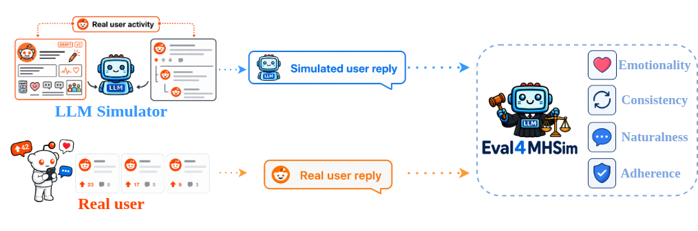
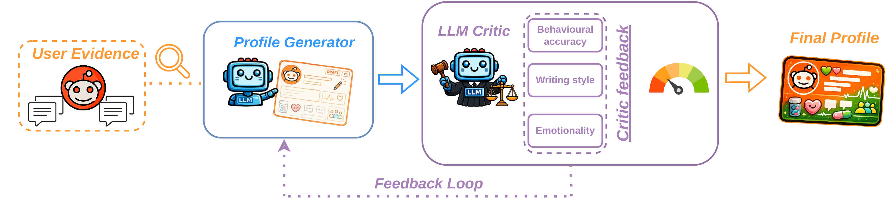

<h1 align="center">Eval4MHSim: An Evaluation Framework and Persona Collection for Mental Health User Simulation</h1>

<p align="center">
  <a href="https://orcid.org/0009-0000-8457-1115">Eliseo Bao</a>, <a href="https://orcid.org/0000-0002-0480-006X">Anxo Pérez</a>, <a href="https://orcid.org/0000-0002-5997-8252">Javier Parapar</a>
  <br>
  IRLab, CITIC, Universidade da Coruña, Spain
</p>

<p align="center">
  <a href="https://huggingface.co/datasets/irlab-udc/erisk-depression-personas"></a>
  <a href="https://huggingface.co/datasets/irlab-udc/erisk-depression-personas-sample"></a>
  <a href="LICENSE"></a>
</p>

<p align="center">
  
</p>

## Abstract

> LLM-based user simulators are usually evaluated on persona consistency and turn-level coherence. These properties do not guarantee that generated text reproduces the affective characteristics of the target population. A simulator that misrepresents emotion distributions cannot stand in for the target users, for example when generating data to evaluate depression-screening systems. We study this problem for real social media users with self-reported depression severity, whose emotional expression is a clinically relevant signal. To address it, we introduce Eval4MHSim, a multidimensional framework for evaluating persona-grounded simulation of these users. Building on Eval4Sim, the framework evaluates adherence, consistency, naturalness, and *emotionality*, a new dimension measuring alignment between real and simulated emotion distributions. We also propose **POWER**, an LLM persona construction pipeline that transforms behavioral profiles and user writing samples into affectively grounded personas. We construct personas for 116 eRisk Reddit users who completed the Beck Depression Inventory (BDI-II). On 63 of them, we evaluate 27 configurations crossing persona type, in-context examples, and Gemma 3 size. Same-user in-context examples are the strongest driver of alignment with the users' real replies. Combining them with **POWER** personas yields the best overall Eval4MHSim score, with a 12B model outperforming all 27B configurations. We release the **P** and **POWER** personas, their BDI-II labels, and all code.

The [supplementary material](SUPPLEMENTARY.md), which is not part of the paper, contains the PersonaChat generalization analysis, all prompt templates, an example P and POWER persona, and the per-dimension results of the 27 configurations.

## Quick Start

Simulate a user's reply with a persona from the public sample:

```python
from datasets import load_dataset
from vllm import LLM, SamplingParams

personas = load_dataset("irlab-udc/erisk-depression-personas-sample", "personas_power", split="train")

TASK = (
    "\n\nYou are now on Reddit. Embody this person fully and write their reply to the post below. "
    "Be authentic to their voice — casual, direct, and natural, as real Reddit comments are. "
    "Do not explain, analyze, or be verbose. Just reply as they would."
)
messages = [
    {"role": "system", "content": personas[0]["system_prompt"] + TASK},
    {"role": "user", "content": "<text of the Reddit post>"},
]

llm = LLM("google/gemma-3-4b-it")
output = llm.chat(messages, SamplingParams(temperature=0.7, max_tokens=512))
print(output[0].outputs[0].text)
```

## What Is Released

| Artefact | Access |
|---|---|
| Code (this repository) | Public, [MIT License](LICENSE) |
| P and POWER personas with BDI-II labels, 116 users | [irlab-udc/erisk-depression-personas](https://huggingface.co/datasets/irlab-udc/erisk-depression-personas), gated: access is approved manually after accepting the terms of use |
| Anonymized sample, 3 users | [irlab-udc/erisk-depression-personas-sample](https://huggingface.co/datasets/irlab-udc/erisk-depression-personas-sample), public |
| eRisk writings and BDI-II questionnaires | From the [eRisk](https://erisk.irlab.org/) organizers, under their user agreement |
| Reddit activity and simulated replies | Not released |

Of the 170 eRisk users, 116 have a RedditMetis profile and are in the persona collection; 63 of them have test replies and are used in the paper's experiments.

## Intended Use

The personas and code are intended for research on user simulation and its evaluation. They must not be used to diagnose, screen or profile real people, or to identify or contact the users behind the personas. Personas are LLM-generated and may contain errors. BDI-II scores are self-reported and are not clinical diagnoses.

## Repository Structure

```
src/
  dataset_gathering/            # Reddit activity collection and dataset construction
  persona_descriptions/         # RedditMetis profiles and P/POWER persona construction
  persona_simulation/           # Simulation (simulate.py, vLLM-based)
  e4s/
    adherence/                  # ColBERT-based adherence evaluation
    consistency/                # Authorship verification (TF-IDF, PAN metrics)
    naturalness/                # Dialogue NLI naturalness evaluation
    emotionality/               # Ekman emotion classification and JSD scoring
    emotionality_personachat/   # Emotionality against the PersonaChat reference
    overall/                    # Aggregate scores and tables
  scripts/                      # SLURM job scripts for each pipeline stage
```

## Setup

**Requirements:** Python 3.10, CUDA-capable GPU(s); Singularity for the SLURM scripts.

```bash
# 1. Configure environment variables (HF token, cache paths, Reddit API credentials, container image)
cp secrets_example secrets

# 2. Create a virtualenv and install dependencies
bash src/scripts/configure_setup.sh
playwright install chromium
mkdir -p logs
```

## Pipeline

Steps must be run in order. GPU stages have a SLURM script in `src/scripts/`; outside SLURM, run the Python command in the script body.

### 1. eRisk inputs

Place the eRisk data under `data/`:

- `data/usernames`: one Reddit username per eRisk user.
- `data/cuestionarios/`: one eRisk XML file of writings per user, named `<username>.xml`, used to set each user's cutoff date.

### 2. Behavioral profiles and P personas

```bash
python src/persona_descriptions/fetch_redditmetis.py
python src/persona_descriptions/fetch_sources.py
python src/persona_descriptions/build_prompts_p.py
python src/persona_descriptions/generate_personas_p.py --model meta-llama/Llama-3.3-70B-Instruct   # GPU
```

**P** converts each user's RedditMetis profile into a persona with Llama 3.3 70B and writes `data/personas_p.jsonl`.

### 3. Reddit activity and dataset

```bash
python src/dataset_gathering/build_cutoffs.py
python src/dataset_gathering/fetch_activity.py
python src/dataset_gathering/build_dataset.py
python src/dataset_gathering/clean_dataset.py
```

Comments and threads are collected with the Reddit API up to each user's last eRisk writing, then split per user into `data/dataset_train.jsonl` and `data/dataset_test.jsonl`.

### 4. POWER personas

<p align="center">
  
</p>

```bash
python src/persona_descriptions/build_prompts_power.py
sbatch src/scripts/run_generate_personas_optimized.sh
```

**POWER** conditions on up to 20 training writing samples per generator iteration, runs three generator iterations with critic feedback from Phi-4 on behavioral, stylistic and affective dimensions, and writes `data/personas_power.jsonl`.

### 5. Simulation

`src/scripts/run_simulation.sh` runs the 27 configurations (3 Gemma 3 sizes × 3 persona settings × 3 conditioning strategies):

```bash
sbatch src/scripts/run_simulation.sh

# Single configuration (ICL-POWER with Gemma 3 12B)
python src/persona_simulation/simulate.py \
    --model google/gemma-3-12b-it \
    --persona-source optimized \
    --personas-optimized data/personas_power.jsonl \
    --persona-tag power \
    --few-shot-k 10 \
    --few-shot-source same_user
```

Persona settings: none (`--persona-source none`), **P** (`default`) and **POWER** (`optimized`). Conditioning strategies: **ZS** (`--few-shot-k 0`), **ICL** (`--few-shot-source same_user`) and **ICLR** (`--few-shot-source random_user`, a control). Simulations are written to `data/simulations/`.

### 6. Evaluation

Each dimension runs independently and writes to `data/results/`:

```bash
sbatch src/scripts/run_adherence.sh      # ColBERT retrieval
sbatch src/scripts/run_consistency.sh    # Authorship verification
sbatch src/scripts/run_naturalness.sh    # Dialogue NLI
sbatch src/scripts/run_emotionality.sh   # Ekman emotion distributions
```

### 7. Aggregate scores and tables

Restrict the outputs to the evaluated users, then build the overall table:

```bash
python src/e4s/overall/filter_results.py --users users.jsonl --output data/results_filtered
python src/e4s/overall/table_overall.py \
    --adherence data/results_filtered/adherence/similarity.csv \
    --consistency data/results_filtered/consistency/ \
    --naturalness data/results_filtered/naturalness/overall_summary.json \
    --emotionality data/results_filtered/emotionality/similarity.csv \
    --output data/results_filtered/overall.tex
```

## Emotionality Generalization (PersonaChat)

The paper also compares the emotion distributions of the original Eval4Sim simulations (Gemma 3 and Qwen3) with the PersonaChat reference. Place the PersonaChat reference at `data/original_e4s/personachat.jsonl` and the [Eval4Sim](https://github.com/IRLab-UDC/eval4sim) simulations under `data/original_e4s/simulations/`, then run:

```bash
sbatch src/scripts/run_emotionality_personachat.sh
python src/e4s/emotionality_personachat/fill_results_table.py
```

## License

Code is released under the [MIT License](LICENSE). The persona datasets have their own terms of use on Hugging Face.

## Contact

Use [GitHub issues](https://github.com/IRLab-UDC/eval4mhsim/issues) for bugs and questions about the code. For dataset access and other inquiries, contact [eliseo.bao@udc.es](mailto:eliseo.bao@udc.es).

## Citation

The citation for this paper will be added upon publication. Eval4MHSim builds on Eval4Sim:

```bibtex
@inproceedings{bao2026eval4sim,
  title     = {Eval4Sim: An Evaluation Framework for Persona Simulation},
  author    = {Bao, Eliseo and Perez, Anxo and Parapar, Javier and Wang, Xi},
  booktitle = {Proceedings of the 35th ACM International Conference on Information and Knowledge Management},
  series    = {CIKM '26},
  year      = {2026},
  doi       = {10.1145/3799682.3840172}
}
```

## Acknowledgements

The first author acknowledges the support of the Department of Education, Science, Universities, and Vocational Training of the Xunta de Galicia (grant ED481A-2024-079). All authors affiliated with IRLab and CITIC acknowledge funding from the Ministry of Science, Innovation and Universities of the Government of Spain (projects PID2022-137061OB-C21, PID2025-167749OB-C22), as well as from the Department of Education, Science, Universities, and Vocational Training of the Xunta de Galicia (grant GRC ED431C 2025/49). CITIC, as a center accredited for excellence within the Galician University System and a member of the CIGUS Network, receives subsidies from the Department of Education, Science, Universities, and Vocational Training of the Xunta de Galicia. Additionally, CITIC is co-financed by the EU through the FEDER Galicia 2021-27 operational program (Ref. ED431G 2023/01).
